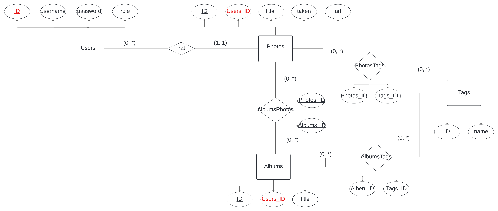

# Projektanforderungen

## Projektbeschreibung
**Erstellen Sie eine Webanwendung, die multiuser-fähig ist und den Nutzern ermöglicht, Fotos zu verwalten und in Fotoalben zu organisieren.**

---

## Technische Anforderungen

| Nr. | Anforderung      | Beschreibung                                                | Erfüllt |
|-----|------------------|-------------------------------------------------------------|---------|
| 1   | **Frontend**     | Umsetzung mit HTML, CSS, Bootstrap, Typescript, Fetch-API   | ✅       |
| 2   | **Backend**      | Implementierung mit Java, Eclipse Vert.x, RESTful-API, JDBC | ✅       |
| 3   | **Datenhaltung** | Nutzung von MariaDB zur Datenhaltung                        | ✅       |

---

## Anforderungen

### 1. Login
| Nr. | Anforderung       | Beschreibung                                                                         | Erfüllt |
|-----|-------------------|--------------------------------------------------------------------------------------|---------|
| 1.1 | **Loginseite**    | Nutzer kann sich mit Nutzernamen und Passwort anmelden                               | ✅       |
| 1.2 | **Validierung**   | Validierung der Eingaben und entsprechende Fehlermeldungen bei fehlerhaften Eingaben | ✅       |
| 1.3 | **Weiterleitung** | Weiterleitung zur Fotoalbumansicht bei erfolgreicher Anmeldung                       | ✅       |
| 1.4 | **Fehlermeldung** | Anzeige einer Fehlermeldung bei nicht erfolgreicher Anmeldung                        | ✅       |
| 1.5 | **Logout**        | Nutzer wird nach Logout automatisch zur Loginseite weitergeleitet                    | ✅       |

### 2. Benutzerverwaltung (Rolle Admin)
| Nr. | Anforderung                   | Beschreibung                                                                                         | Erfüllt |
|-----|-------------------------------|------------------------------------------------------------------------------------------------------|---------|
| 2.1 | **Admin-Existenz**            | Ein Admin existiert in der Datenbank und wird über ein DDL-Skript angelegt                           | ✅       |
| 2.2 | **Nutzerkontenverwaltung**    | Admin kann Nutzerkonten verwalten (Anzeigen, Suchen, Hinzufügen, Bearbeiten, Löschen)                | ✅       |
| 2.3 | **Einzigartigkeit**           | Nutzername ist eindeutig über alle Benutzer hinweg                                                   | ✅       |
| 2.4 | **Passwortsicherheit**        | Passwörter werden gehasht in der Datenbank gespeichert                                               | ✅       |
| 2.5 | **Rollenbeschränkung**        | Es können keine weiteren Admins erstellt werden                                                      | ✅       |
| 2.6 | **Nutzerkonteninformationen** | Nutzerkonten enthalten mindestens einen Nutzernamen, ein Passwort und eine Rolle (Nutzer oder Admin) | ✅       |


### 3. Fotos
| Nr. | Anforderung            | Beschreibung                                                            | Erfüllt |
|-----|------------------------|-------------------------------------------------------------------------|---------|
| 3.1 | **Fotoverwaltung**     | Verwalten (Anzeigen, Suchen, Hinzufügen, Bearbeiten, Löschen) von Fotos | ✅       |
| 3.2 | **Pflichtfelder**      | Ein Foto muss Titel und Aufnahmedatum enthalten                         | ✅       |
| 3.3 | **Schlagwörter**       | Fotos können beliebig viele Schlagwörter enthalten                      | ✅       |
| 3.4 | **Änderbarkeit**       | Titel, Datum und Schlagwörter müssen änderbar sein                      | ✅       |
| 3.5 | **Nutzergebundenheit** | Fotos gehören einem Nutzer und sind nur für diesen sichtbar             | ✅       |

### 4. Fotoalben
| Nr. | Anforderung             | Beschreibung                                                                | Erfüllt |
|-----|-------------------------|-----------------------------------------------------------------------------|---------|
| 4.1 | **Fotoalbumverwaltung** | Verwalten (Anzeigen, Suchen, Hinzufügen, Bearbeiten, Löschen) von Fotoalben | ✅       |
| 4.2 | **Pflichtfelder**       | Ein Fotoalbum muss einen Titel haben                                        | ✅       |
| 4.3 | **Schlagwörter**        | Fotoalben können beliebig viele Schlagwörter enthalten                      | ✅       |
| 4.4 | **Änderbarkeit**        | Titel und Schlagwörter müssen änderbar sein                                 | ✅       |
| 4.5 | **Fotos in Alben**      | Fotoalben enthalten beliebig viele Fotos                                    | ✅       |
| 4.6 | **Nutzergebundenheit**  | Fotoalben gehören einem Nutzer und sind nur für diesen sichtbar             | ✅       |
| 4.7 | **Suchfunktion**        | Suche nach Fotoalben mit Anzeige der zugehörigen Fotos                      | ✅       |

---

## Nicht funktionale Anforderungen
| Nr. | Anforderung                   | Beschreibung                                                                                                              | Erfüllt |
|-----|-------------------------------|---------------------------------------------------------------------------------------------------------------------------|---------|
| 1   | **RESTful-API**               | Bereitstellung einer RESTful-API für das Frontend                                                                         | ✅       |
| 2   | **Dokumentation**             | Vollständige Projektdokumentation in der README.md (Inbetriebnahme, DDL-Skript, ERM, RESTful-API, Anforderungsauflistung) | ✅       |
| 3   | **Source-Code Dokumentation** | Dokumentation mit JavaDoc und TSDoc                                                                                       | ✅       |

---


# Informationen zur Inbetriebnahme der Anwendung


## Voraussetzungen

Bevor du mit der Inbetriebnahme der Anwendung beginnst, stelle sicher, dass die folgenden Tools und Dienste auf deinem System installiert sind:

- **Git**: [Git installieren](https://git-scm.com/) – Zum Klonen des Repositories.
- **Java Development Kit (JDK) 11 oder höher**: [JDK installieren](https://www.oracle.com/java/technologies/javase-jdk11-downloads.html) – Erforderlich, um das Vert.x-Backend auszuführen.
- **Maven**: [Maven installieren](https://maven.apache.org/install.html) – Zum Bauen und Verwalten von Java-Projekten.
- **Node.js** und **npm**: [Node.js installieren](https://nodejs.org/) – Zum Bauen und Ausführen des TypeScript-Frontends.
- **MariaDB**: [MariaDB installieren](https://mariadb.org/download/) – Zum Verwenden der Datenbank, die von der Anwendung benötigt wird.
- **Browser**: Ein moderner Webbrowser (z.B. Chrome, Firefox) – Zum Testen und Anzeigen des Frontends.
- **Internetverbindung**: Da Bootstrap über ein CDN eingebunden ist, benötigst du eine Internetverbindung, um die Bootstrap-Stylesheets und -Skripte zu laden.

## Schritt 1: Repository klonen

Zuerst musst du das Repository auf deinen lokalen Rechner klonen. Du kannst dies entweder mit HTTPS oder SSH tun:

### Via HTTPS:
```bash
git clone https://git.thm.de/informatik-projekt/sose-2024-suess-rupp/gruppe-1.git
```

### Via SSH:
```bahs
git clone git@git.thm.de:informatik-projekt/sose-2024-suess-rupp/gruppe-1.git
```

## Schritt 2: In das Projektverzeichnis wechslen
```bash
cd gruppe-1
```

## Schritt 3: Das ddl-Skript ausführen und die MariaDB-Client-Sitzung beenden
```bash 
mysql -u your_user -p your_password;
source ddl.sql;
exit;
```

## Schritt 4: Passe die Datenbankkonfiguration in der config.json an
```bash
cd photoalbums/src/main/resources/

```

## Schritt 5: Projekt bauen und starten
```bash
cd ../../../

./mvnw clean compile exec:java
```

## Schritt 6:  Anwendung im Broswer ausführen
Öffne deinen Browser und gehe zu_
```
http://localhost:8080
```


# ERM-Diagramm



# Beschreibung der RESTful-API

> Wenn bei einer Route kein Statuscode bei Erfolg angegeben ist, <br>
> wird bei Erfolg Statuscode 200 mit einer entsprechenden Statusmeldung zurückgegeben.

### POST /login  
> Gibt Statuscode 303 mit entsprechenden Location-Header zurück, wenn der Login erfolgreich war, d.h. das Paar Benutzername und Passwort existiert.  
> Die Passwörter sind mit Bcrypt (round 10) gehasht in der Datenbank gespeichert.

http-Request
```JSON
{
  "username" : "___",
  "password" : "___"
}
```

http-Response
1. Gibt Statuscode 400 zurück, wenn der username oder das password null sind oder die Anfrage an die Route falsch formatiert ist.
```JSON
{
  "message": "Die Anfrage muss folgendes Format haben und die keys username und password sind nicht null-Werte",	  
  "username": "___",
  "password": "___"
}
```
2. Gibt Statuscode 400 zurück, wenn der Benutzername Leerzeichen enthält.
```JSON
{
  "message": "Der Nutzername darf keine Leerzeichen enthalten"
}
```

3. Gibt Statuscode 400 zurück, wenn das Passwort Leerzeichen enthält.
```JSON
{
  "message": "Das Passwort darf keine Leerzeichen enthalten"
}
```

4. Gibt Statuscode 400 zurück, wenn der Benutzername leer ist.
```JSON
{
  "message": "Der Nutzername darf nicht leer sein"
}
```

5. Gibt Statuscode 400 zurück, wenn das Password leer ist.
```JSON
{
  "message": "Das Passwort darf nicht leer sein"
}
```

6. Gibt Statuscode 400 zurück, wenn das Password kürzer als 4 oder länger als 30 Zeichen ist.
```JSON
{
  "message": "Das Passwort muss zwischen 4 und 30 Zeichen lang sein"
}
```

7. Gibt Statuscode 400 zurück, wenn der Benutzername länger als 30 Zeichen ist.
```JSON
{
  "message": "Der Nutzername darf höchstens 30 Zeichen lang sein"
}
```

8. Gibt Statuscode 400 zurück, wenn der Nutzername _oder_ das Passwort falsch ist.
```JSON
{
  "message": "Nutzername oder Passwort falsch"
}
```

9. Gibt Statuscode 500 mit entsprechender Fehlermeldung zurück, wenn ein Server- und/oder Datenbankfehler aufgetreten ist.


---


### GET /username  
> Eine Route, um den Nutzernamen des Benutzs abzurufen und im Frontend anzuzeigen.

```JSON
{
	"username": "noel"
}
```

1. Gibt Statuscode 401 mit entsprechender Fehlermeldung zurück, wenn der Benutzer nicht angemeldet ist.
```JSON
{
	"message": "Bitte melde dich zuerst an, um diese Route aufrufen zu dürfen."
}
```


---


### GET /role  
> Eine Route, um die Rolle des Benutzers abzufragen. Im Frontend wird je nach Rolle der Button zum Admin-Tool angezeigt.

1. Gibt Statuscode 401 mit entsprechender Fehlermeldung zurück, wenn der Benutzer nicht angemeldet ist.
```JSON
{
	"message": "Bitte melde dich zuerst an, um diese Route aufrufen zu dürfen."
}
```


---


### POST /logout  
> Statuscode 303 mit Location-Header auf die login.html Seite

1. Die Session ist bereits zerstört, also ungültig.
```JSON
{
	"message": "Die Session ist ungültig oder abgelaufen. Bitte melden Sie sich erneut an"
}
```


---


### GET /photos
> Gibt Statuscode 200 und JSON mit allen Fotoinformationen inklusive Tags als kommaseparierter String zurück.

http-Res:


```JSON
{
	"photos": [
		{
			"id": 1,
			"title": "dasda",
			"taken": "2022-12-02",
			"imgUrl": "1.jpg",
			"tags": null
		},
		{
			"id": 2,
			"title": "test",
			"taken": "2012-12-12",
			"imgUrl": "2.jpg",
			"tags": null
		}
	]
}
```

1. Gibt Statuscode 401 mit entsprechender Fehlermeldung zurück, wenn der Benutzer nicht angemeldet ist.
```JSON
{
	"message": "Bitte melde dich zuerst an, um diese Route aufrufen zu dürfen."
}
```

2. Gibt Statuscode 500 mit Fehlermeldung zurück, wenn ein Server- und/oder Datenbankfehler aufgetreten ist.


---


### GET photos/photoTitle=searchQuery&tag=serachQuery  
> Route, um Fotos zu durchsuchen. Es können diesleben Fehler wie oben auftreten.  


---


### GET /img/:photoID
> Sendet das Bild mit der entsprechenden ID.  
> Namenskonvention. Jedes Bild ist mit ID.jpg oder ID.png gespeichert.

1. Wenn kein Benutzer angemeldet ist, wird die http-Anfrage hier mit einem 401 Unauthorized und einer entsprechenden Fehlermeldung abgewiesen.
```JSON
{
	"message": "Bitte melde dich zuerst an, um diese Route aufrufen zu dürfen."
}
```

2. Gibt Statuscode 404 mit entsrechender Fehlermeldung zurück, wenn das Bild nicht gefunden wurde.
```JSON
{
	"message": "Das Foto wurde nicht gefunden."
}
```

3. Gibt Statuscode 403 mit entsprechender Fehlermeldung zurück, wenn das Foto nicht dem Benutzer gehört.
```JSON
{
	"message": "Das Foto gehört nicht dem Benutzer"
}
```

4. Statuscode 400 mit entsprechender Fehlermeldung, wenn die imageID (Pfadparameter) keine gültige Zahl ist.
```JSON
{
	"message": "photoID muss eine gültige Zahl sein"
}
```


---


### DELETE photos/tag  
> Statuscode 204, wenn der Tag erfolgreich gelöscht wurde.

http-Request
```JSON
{
  "photoID" : 1,
  "tag" : "___"
}
```

1. Wenn kein Benutzer angemeldet ist, wird die http-Anfrage hier mit einem 401 Unauthorized und einer entsprechenden Fehlermeldung abgewiesen.
```JSON
{
	"message": "Bitte melde dich zuerst an, um diese Route aufrufen zu dürfen."
}
```
2. Gebe Statuscode 400 mit enstsprechender Fehlermeldung zurück, wenn photoID einen ungültigen Wert enthält
```JSON
{
	"message": "photoID muss eine gültige Zahl sein"
}
```

3. Gebe Statuscode 400 mit ensprechender Fehlermeldung zurück, wenn der das Feld tag leer ist, Leerzeichen enthält, länger als 30 Zeichen ist, oder null ist
```JSON
{
  "message" : "Der Tag darf keine Leerzeichen enthalten"
}
```

```JSON
{
  "message" : "Der Tag darf nicht leer sein"
}
```

```JSON
{
  "message" : "Der Tag darf nicht länger als 30 Zeichen sein sein"
}
```

```JSON
{
  "message" : "tag darf nicht null sein"
}
```

4. Gibt Statuscode 404 mit entsrechender Fehlermeldung zurück, wenn das Bild nicht gefunden wurde.
```JSON
{
	"message": "Das Foto wurde nicht gefunden."
}
```

5. Gibt Statuscode 403 mit entsprechender Fehlermeldung zurück, wenn das Foto nicht dem Benutzer gehört.
```JSON
{
	"message": "Das Foto gehört nicht dem Benutzer"
}
```

6. Gibt Statuscode 404 mit entsprechender Fehlermeldung zurück, der Tag nicht existiert
```JSON
{
	"message": "Der Tag existiert nicht"
}
```

7. Statuscode 500 mit entsprechender Fehlermeldung, wenn ein Server- und/oder Datenbankfehler auftritt


---


### POST /photos/tag  
> Gebe Statuscode 201 mit entsprechender Erfolgsmelsung zurück, wenn Tag erfolgreich angelegt wurde.  

http-Anfrage
```JSON
{
  "photoID" : 1,
  "tag" : "___"
}
```

1. Wenn kein Benutzer angemeldet ist, wird die http-Anfrage hier mit einem 401 Unauthorized und einer entsprechenden Fehlermeldung abgewiesen.
```JSON
{
	"message": "Bitte melde dich zuerst an, um diese Route aufrufen zu dürfen."
}
```

2. Statuscode 400 mit entsprechender Fehlermeldung, wenn die imageID (Pfadparameter) keine gültige Zahl ist.
```JSON
{
	"message": "photoID muss eine gültige Zahl sein"
}
```

3. Gebe Statuscode 400 mit ensprechender Fehlermeldung zurück, wenn der das Feld tag leer ist, Leerzeichen enthält oder null ist
```JSON
{
  "message" : "Der Tag darf keine Leerzeichen enthalten"
}
```

```JSON
{
  "message" : "Der Tag darf nicht länger als 30 Zeichen sein sein"
}
```

```JSON
{
  "message" : "Der Tag darf nicht leer sein"
}
```

```JSON
{
  "message" : "tag darf nicht null sein"
}
```

4. Gibt Statuscode 404 mit entsrechender Fehlermeldung zurück, wenn das Bild nicht gefunden wurde.
```JSON
{
	"message": "Das Foto wurde nicht gefunden."
}
```

5. Gibt Statuscode 403 mit entsprechender Fehlermeldung zurück, wenn das Foto nicht dem Benutzer gehört.
```JSON
{
	"message": "Das Foto gehört nicht dem Benutzer"
}
```

6. Statuscode 409, wenn der Tag bereits existiert.
```JSON
{
  "message" : "Der Tag existiert bereits"
}
```

7. Statuscode 500, wenn ein Datenbank- oder Serverfehler auftritt
```JSON
{
  "message" : "Ein interner Serverfehler ist aufgetreten"
}
```


---


### PATCH /photos/photoTitle
> Statuscode 200  mit entsprechdner Erfolgsmeldung und dem neuen Titel, wenn der Titel des Fotos geändert wurde

http-Anfrage

```JSON
{
  "photoID" : 1,
  "photoTitle" : "___"
}
```

http-Res

```JSON
{
  "message" : "Der Fototitel wurder erfolgreich geändert",
  "photoTitle" : "___"
}
```

mögliche Fehlermeldungen:

1. Wenn kein Benutzer angemeldet ist, wird die http-Anfrage hier mit einem 401 Unauthorized und einer entsprechenden Fehlermeldung abgewiesen.
```JSON
{
	"message": "Bitte melde dich zuerst an, um diese Route aufrufen zu dürfen."
}
```

2. Statuscode 400 mit entsprechender Fehlermeldung, wenn die imageID (Pfadparameter) keine gültige Zahl ist.
```JSON
{
	"message": "photoID muss eine gültige Zahl sein"
}
```

3. Statuscode 400, wenn der Titel leer ist bzw. nur aus Leerzeichen besteht.
```JSON
{
  "message" : "Der Titel darf nicht leer sein"
}
```

4. Statuscode 400, wenn der Titel länger als 30 Zeichen ist
```JSON
{
  "message" : "Der Titel darf maximal 30 Zeichen lang sein"
}
```

5. Gibt Statuscode 404 mit entsrechender Fehlermeldung zurück, wenn das Bild nicht gefunden wurde.
```JSON
{
	"message": "Das Foto wurde nicht gefunden."
}
```

6. Gibt Statuscode 403 mit entsprechender Fehlermeldung zurück, wenn das Foto nicht dem Benutzer gehört.
```JSON
{
	"message": "Das Foto gehört nicht dem Benutzer"
}
```

7. Statuscode 500, wenn ein Datenbank- oder Serverfehler auftritt
```JSON
{
  "message" : "Ein interner Serverfehler ist aufgetreten"
}
```


---

### PATCH /photos/photoDate
> Gibt Statuscode 200 mit enstprechender Erfolgsmeldung zurück, wenn der Titel des Bildes erfolgreich geändert wurde.


http-Anfrage:
```JSON
{
  "photoID" : 1,
  "date" : "___"
}
```

http-Res:

```JSON
{
  "message" : "Das Datum des Fotos wurde erfolgreich geändert",
  "newDate" : "___"
}
```

mögliche Fehlermeldungen:

1. Gibt Statuscode 401 mit entsprechender Fehlermeldung zurück, wenn der Benutzer nicht angemeldet ist.
```JSON
{
	"message": "Bitte melde dich zuerst an, um diese Route aufrufen zu dürfen."
}
```

2. Statuscode 400 mit entsprechender Fehlermeldung, wenn die imageID (Pfadparameter) keine gültige Zahl ist.
```JSON
{
	"message": "photoID muss eine gültige Zahl sein"
}
```

3. Gibt Statuscode 404 mit entsrechender Fehlermeldung zurück, wenn das Bild nicht gefunden wurde.
```JSON
{
	"message": "Das Foto wurde nicht gefunden."
}
```

4. Gibt Statuscode 403 mit entsprechender Fehlermeldung zurück, wenn das Foto nicht dem Benutzer gehört.
```JSON
{
	"message": "Das Foto gehört nicht dem Benutzer"
}
```

5. Gebe Status 400 mit entsprechender Fehlermeldung zurück, wenn das Datum nicht korrekt formatiert ist oder in der Zukunft liegt.  
```JSON
{
  "message" : "Ungültiges Feld date: Das Datum muss im Format 'YYYY-MM-DD' vorliegen und in der Vergangenheit liegen"
}
```

6. Gebe Statusocde 500 mit entpsrechender Fehlermeldung zurück, wenn ein Server und/oder Datenbankfehler aufgetreten ist.
```JSON
{
  "message" : "Ein interner Serverfehler ist aufgetreten"
}
```


---


### DELETE /img/:photoID  
> Gibt Statuscode 204 zurück, wenn das Foto erfolgreich gelöscht wurde.

1. Gibt Statuscode 401 mit entsprechender Fehlermeldung zurück, wenn der Benutzer nicht angemeldet ist.
```JSON
{
	"message": "Bitte melde dich zuerst an, um diese Route aufrufen zu dürfen."
}
```

2. Statuscode 400 mit entsprechender Fehlermeldung, wenn die imageID (Pfadparameter) keine gültige Zahl ist.
```JSON
{
	"message": "photoID muss eine gültige Zahl sein"
}
```

3. Gibt Statuscode 404 mit entsrechender Fehlermeldung zurück, wenn das Bild nicht gefunden wurde.
```JSON
{
	"message": "Das Foto wurde nicht gefunden."
}
```

4. Gibt Statuscode 403 mit entsprechender Fehlermeldung zurück, wenn das Foto nicht dem Benutzer gehört.
```JSON
{
	"message": "Das Foto gehört nicht dem Benutzer"
}
```

5. Statuscode 500, wenn ein Fehler beim Löschen des Fotos aufgetreten ist.
```JSON
{
  "message" : "Fehler beim Löschen des Fotos"
}
```

---

### POST /photos   
> Gibt Statuscode 201 zurück, wenn das Foto erfolgreich hochgeladen wurde.

1. Statuscode 400, wenn dass Datum ungültig ist (in der Zukunft oder falsch formatiert).
```JSON
{
  "message" : "Ungültiges Feld date: Das Datum muss im Format 'YYYY-MM-DD' vorliegen und in der Vergangenheit liegen"
}
```

2. Statuscode 400, wenn die hochgeladene Datei keine JPEG oder PNG Datei ist.
```JSON
{
  "message" : "Die hochgeladene Datei muss eine Bilddatei des Typs JPEG oder PNG sein"
}
```

3. Statuscode 500, wenn beim Speichern der Datei ein Fehler auftritt.
```JSON
{
  "message" : "Fehler beim speichern des Fotos auf dem Server"
}
```

3. Statuscode 500, wenn beim Anlegen der Datei ein Fehler auftritt.
```JSON
{
  "message" : "Fehler beim Upload des Fotos"
}
```

4. Statuscode 400, wenn keine Bilddatei mitgesendet wurde.
```JSON
{
  "message" : "Es wurde keine Bilddatei mitgesendet"
}
```

5. Statuscode 400, wenn der Titel leer ist.
```JSON
{
  "message" : "Der Titel darf nicht leer sein"
}
```

6. Statuscode 400, wenn der Titel länger als 30 Zeichen ist.
```JSON
{
  "message" : "Der Titel darf maximal 30 Zeichen lang sein"
}
```

7. Statuscode 500, wenn die validierung des Titels fehlschlägt (ungültiger Header).
```JSON
{
  "message" : "Fehler bei Überprüfung des Titels"
}
```

8. Statuscode 401, wenn kein Nutzer angemeldet ist.
```JSON
{
  "message" : "Bitte melde dich zuerst an, um diese Route aufzurufen"
}
```

---

### GET /users

http-Response: 
```JSON
{
  "users" : [
    {
      "id" : 1,
      "username" : "admin",
      "passwort" : "root",
      "role" : "ADMIN"
    },
    {
      "id" : 2,
      "username" : "noel",
      "passwort" : "0610",
      "role" : "USER"
    }
  ]
}
```

mögliche Fehlermeldungen:

1. Statuscode 401, wenn kein Nutzer angemeldet ist.
```JSON
{
  "message" : "Bitte melde dich zuerst an, um diese Route aufzurufen"
}
```

2. Statusode 403, wenn der angemeldete Benutzer kein Admin ist.  
```JSON
{
  "message" : "Der angemeldete Benutzer ist kein Admin."
}
```

3. Statuscode 500, wenn ein Server- und /oder Datenbankfehler aufgetreten ist.
```JSON
{
  "message" : "Ein interner Server- und/oder Datenbankfehler ist aufgetreten "
}
```

---

### DELETE /users/:userID
> Gibt bei Erfolg Statuscode 204 zurück.

mögliche Fehlermeldungen:

1. Statuscode 401, wenn kein Nutzer angemeldet ist.
```JSON
{
  "message" : "Bitte melde dich zuerst an, um diese Route aufzurufen"
}
```

2. Statusode 403, wenn der angemeldete Benutzer kein Admin ist.
```JSON
{
  "message" : "Der angemeldete Benutzer ist kein Admin."
}
```

3. Statuscode 400, wenn der Pfadparameter keine gültige Zahl ist.
```JSON
{
  "message" : "userID muss eine gültige Zahl sein"
}
```

4. Statuscode 403, wenn veruscht wird, den Admin zu löschen.
```JSON
{
  "message" : "Der Admin darf nicht gelöscht werden"
}
```

5. Statuscode 500, wenn ein Server- und/oder Datenbankfehler auftritt.
```JSON
{
  "message" : "Ein interner Server- und/oder Datenbankfehler ist aufgetreten"
}
```

---

### PATCH /users/username/:userID

http-Request
```JSON
{
  "username" : "Benutzername hier"
}
```

mögliche Fehlermeldungen:

1. Statuscode 401, wenn kein Nutzer angemeldet ist.
```JSON
{
  "message" : "Bitte melde dich zuerst an, um diese Route aufzurufen"
}
```

2. Statusode 403, wenn der angemeldete Benutzer kein Admin ist.
```JSON
{
  "message" : "Der angemeldete Benutzer ist kein Admin."
}
```

3. Statuscode 400, wenn der Pfadparameter keine gültige Zahl ist.
```JSON
{
  "message" : "userID muss eine gültige Zahl sein"
}
```

4. Statuscode 400, wenn der Nutzername leer ist oder nur aus Leerzeichen besteht.
```JSON
{
  "message" : "Der Nutzername darf nicht leer sein"
}
```

5. Statuscode 400, wenn der Nutzername Leerzeichen enthält
```JSON
{
  "message" : "Der Nutzername darf keine Leerzeichen enthalten"
}
```

6. Statuscode 400, wenn der Nutzername mehr als 30 Zeichen hat
```JSON
{
  "message" : "Der Nutzername darf höchstens 30 Zeichen lang sein"
}
```

7. Statuscode 409, wenn der Nutzername bereits existiert
```JSON
{
  "message" : "Der Nutzername existiert bereits"
}
```

8. Statuscode 500, wenn ein Server- und/oder Datenbankfehler auftritt
```JSON
{
  "message" : "Ein interner Serverfehler ist aufgetreten"
}
```


---


### PATCH /users/password/:userID

http-Request
````JSON
{
  "password" : "password"
}
````

mögliche Fehlermeldungen:

1. Statuscode 401, wenn kein Nutzer angemeldet ist.
```JSON
{
  "message" : "Bitte melde dich zuerst an, um diese Route aufzurufen"
}
```

2. Statusode 403, wenn der angemeldete Benutzer kein Admin ist.
```JSON
{
  "message" : "Der angemeldete Benutzer ist kein Admin."
}
```

3. Statuscode 400, wenn der Pfadparameter keine gültige Zahl ist.
```JSON
{
  "message" : "userID muss eine gültige Zahl sein"
}
```

4. Statuscode 400, wenn das Passwort leer ist oder nur aus Leerzeichen besteht
```JSON
{
  "message" : "Das Passwort darf nicht leer sein"
}
```

5. Statuscode 400, wenn das Passwort weniger als 4 oder mehr als 30 Zeichen enthält
```JSON
{
  "message" : "Das Passwort muss zwischen 4 und 30 Zeichen lang sein"
}
```

6. Statuscode 400, wenn das Passwort Leerzeichen enthält
```JSON
{
  "message" : "Das Passwort darf keine Leerzeichen enthalten"
}
```

7. Statuscode 500, wenn ein interner Server- und/oder Datenbankfehler aufgetreten ist
```JSON
{
  "message" : "Ein interner Server- und/oder Datenbankfehler ist aufgetreten"
}
```

### POST /users   
> Gibt Statuscode 201 zurück, wenn der Nutzer erfolgreich anglegt wurde

http-Request
```JSON
{
 "username" : ____ ,
  "password" : ____
}
```

mögliche Fehler:

1. Statuscode 401, wenn kein Nutzer angemeldet ist.
```JSON
{
  "message" : "Bitte melde dich zuerst an, um diese Route aufzurufen"
}
```

2. Statusode 403, wenn der angemeldete Benutzer kein Admin ist.
```JSON
{
  "message" : "Der angemeldete Benutzer ist kein Admin."
}
```

3. Statuscode 400,  wenn der Username oder das Passwort null sind oder die Anfrage an die Route falsch formatiert ist.
```JSON
{
  "message": "Die Anfrage muss folgendes Format haben und die keys username und password sind nicht null-Werte",
  "username": "___",
  "password": "___"
}
```

4. Statusode 400, wenn der Username Leerzeichen enthält.
```JSON
{
  "message" : "Der Nutzername darf keine Leerzeichen enthalten"
}
```

5. Statusode 400, wenn der Username leer ist.
```JSON
{
  "message" : "Der Nutzername darf nicht leer sein"
}
```

6. Statusode 400, wenn der Username länger als 30 Zeichen ist.
```JSON
{
  "message" : "Der Nutzername darf höchstens 30 Zeichen lang sein."
}
```

7. Statusode 400, wenn das Passwort Leerzeichen enthält.
```JSON
{
  "message" : "Das Passwort darf keine Leerzeichen enthalten"
}
```

8. Statusode 400, wenn das Passwort leer ist.
```JSON
{
  "message" : "Das Passwort darf nicht leer sein"
}
```

9. Statusode 400, wenn das Passwort kürzer als 4 oder länger als 30 Zeichen ist.
```JSON
{
  "message" : "Das Passwort muss zwischen 4 und 30 Zeichen lang sein"
}
```

10. Statusode 409, wenn der Nutzername bereits vergeben ist
```JSON
{
  "message" : "Der Nutzername existiert bereits"
}
```

11. Statusode 500, wenn ein Server- oder Datenbankfehler auftritt
```JSON
{
  "message" : "Fehler beim erstellen des Nutzers"
}
```


---

### GET /albums
> Diese Route wird auch für die Suche mit Suchparametern gematcht

http-Response:

```JSON
{
  "albums": [
    {
      "id": 1,
      "title": "Album ohne tags",
      "tags": null
    },
    {
      "id" : 2,
      "title" : "Album mit tags",
      "tags" : "Testtag, Spaß, Weiterer Testtag"
    }
  ]
}
```

mögliche Fehlermeldungen:

1. Statuscode 401, wenn kein Nutzer angemeldet ist.
```JSON
{
  "message" : "Bitte melde dich zuerst an, um diese Route aufzurufen"
}
```

2. Statuscode 500 mit Fehlermeldung wenn ein Server- und/oder Datenbankfehler aufgetreten ist


---

> DELETE /albums/:albumID
> Gebe bei Erfolg Statuscode 204 zurück
 
1. Statuscode 401, wenn kein Nutzer angemeldet ist.
```JSON
{
  "message" : "Bitte melde dich zuerst an, um diese Route aufzurufen"
}
```

2. Statuscode 404, wenn das Album nicht gefunden wurde.
```JSON
{
  "message" : "Das Album wurde nicht gefunden."
}
```

3. Statuscode 500 mit Fehlermeldung wenn ein Server- und/oder Datenbankfehler aufgetreten ist

---


### POST /albums   
> Gibt Statuscode 201 zurück, wenn das Album erfolgreich anglegt wurde

http-Request
```JSON
{
 "title" : ____
}
```

mögliche Fehler:

1. Statuscode 401, wenn kein Nutzer angemeldet ist.
```JSON
{
  "message" : "Bitte melde dich zuerst an, um diese Route aufzurufen"
}
```

2. Statusode 400, wenn der Titel leer ist oder nur aus Leerzeichen besteht
```JSON
{
  "message" : "Der Titel darf nicht leer sein"
}
```

3. Statusode 400, wenn der Titel länger als 30 Zeichen ist
```JSON
{
  "message" : "Der Titel darf maximal 30 Zeichen lang sein"
}
```

4. Statusode 500, wenn ein Server- oder Datenbankfehler auftritt
```JSON
{
  "message" : "Fehler beim erstellen des Albums"
}
```

---
### PATCH /albums/albumsTitle

http-Req
```JSON
{
  "title" : "___",
  "albumID" : 10
}
```

http-Res:

```JSON
{
  "message" : "Der Fototitle wurde erfolgreich geändert",
  "albumTitle" : "Neuer Title des Albums steht hier"
}
```

Mögliche Fehler:

1. Gibt Statuscode 401 mit entsprechender Fehlermeldung zurück, wenn der Benutzer nicht angemeldet ist.
```JSON
{
	"message": "Bitte melde dich zuerst an, um diese Route aufrufen zu dürfen."
}
```

2. Statuscode 400, wenn albumID keine gültige Zahl ist
```JSON
{
  "message" : "albumID muss eine gültige Zahl sein"
}
```

3. Statuscode 400, wenn der Title leer ist
```JSON
{
  "message" : "Der Titel darf nicht leer sein"
}
```

4. Statuscode 400, wenn der Titel zu lang ist
```JSON
{
  "message" : "Der Titel darf maximal 30 Zeichen lang sein"
}
```

5. Statuscode 404, wenn das Album nicht gefunden wurde
```JSON
{
  "message" : "Das Album wurde nicht gefunden"
}
```

6. Statuscode 403, wenn das Album nicht dem Benutzer gehört
```JSON
{
  "message" : "Das Album gehört nicht dem Benutzer"
}
```

7. Statuscode 500, wenn ein Datenbank- oder Serverfehler auftritt
```JSON
{
  "message" : "Ein interner Serverfehler ist aufgetreten"
}
```

### POST /albums/tag 
> Gibt Statuscode 201 zurück, wenn der Tag erfolgreich mit dem Album verknüpft wurde.

http-Req
```JSON
{
  "tag" : "___",
  "albumID" : __
}
```

mögliche Fehlermeldungen:

1. Statuscode 401, wenn kein Nutzer angemeldet ist.
```JSON
{
  "message" : "Bitte melde dich zuerst an, um diese Route aufzurufen"
}
```

2. Statuscode 400, wenn albumID keine gültige Zahl ist
```JSON
{
  "message" : "albumID muss eine gültige Zahl sein"
}
```

3. Statuscode 404, wenn das Album nicht existiert.
```JSON
{
  "message" : "Das Album wurde nicht gefunden."
}
```

4. Statuscode 403, wenn das Album nicht dem Benutzer gehört
```JSON
{
  "message" : "Das Album gehört nicht dem Benutzer"
}
```

5. Statuscode 400, wenn das Feld Tag Leerzeichen enthält
```JSON
{
  "message" : "Der Tag darf keine Leerzeichen enthalten"
}
```

6. Statuscode 400, wenn das Feld Tag leer ist
```JSON
{
  "message" : "Der Tag darf nicht leer sein"
}
```

7. Statuscode 400, wenn der Tag länger als 30 Zeichen ist
```JSON
{
  "message" : "Der Tag darf nicht länger als 30 Zeichen sein sein"
}
```

8. Statuscode 400, wenn das Feld Tag null ist
```JSON
{
  "message" : "tag darf nicht null sein"
}
```

9. Statuscode 409, wenn der Tag bereits mit dem Foto verknüpft ist
```JSON
{
  "message" : "Der Tag existiert bereits"
}
```

10. Statuscode 500, wenn ein Datenbank- oder Serverfehler auftritt
```JSON
{
  "message" : "Ein interner Serverfehler ist aufgetreten"
}
```

### POST /albums/photo  
> Gibt Statuscode 201 zurück, wenn das Foto erfolgreich zum Album hinzugefügt wurde

http-Req
```JSON
{
  "photoID" : __,
  "albumID" : __
}
```

mögliche Fehlermeldungen:

1. Statuscode 401, wenn kein Nutzer angemeldet ist.
```JSON
{
  "message" : "Bitte melde dich zuerst an, um diese Route aufzurufen"
}
```

2. Statuscode 400, wenn photoID keine gültige Zahl ist
```JSON
{
  "message" : "photoID muss eine gültige Zahl sein"
}
```

3. Statuscode 400, wenn albumID keine gültige Zahl ist
```JSON
{
  "message" : "albumID muss eine gültige Zahl sein"
}
```

4. Statuscode 404, wenn das Foto nicht existiert.
```JSON
{
  "message" : "Das Foto wurde nicht gefunden."
}
```

5. Statuscode 404, wenn das Album nicht existiert.
```JSON
{
  "message" : "Das Album wurde nicht gefunden."
}
```

6. Statuscode 403, wenn das Foto nicht dem Benutzer gehört
```JSON
{
  "message" : "Das Foto gehört nicht dem Benutzer"
}
```

7. Statuscode 403, wenn das Album nicht dem Benutzer gehört
```JSON
{
  "message" : "Das Album gehört nicht dem Benutzer"
}
```

8. Statuscode 409, wenn das das Foto bereits mit dem Album verknüpft ist
```JSON
{
  "message" : "Das gewählte Foto ist bereits in diesem Album"
}
```

9. Statuscode 500, wenn ein Server- oder Datenbankfehler auftritt
```JSON
{
  "message" : "Ein interner Serverfehler ist aufgetreten"
}
```

### GET /photos/:albumID

http-Res:
```JSON
{
  "photos": [
    {
      "id": 14,
      "title": "Hundebaby",
      "taken": "2003-10-06",
      "imgUrl": "14.jpg",
      "tags": "Tiere"
    }
  ]
}
```

mögliche Fehlermeldungen:

1. Gibt Statuscode 401 mit entsprechender Fehlermeldung zurück, wenn der Benutzer nicht angemeldet ist.
```JSON
{
	"message": "Bitte melde dich zuerst an, um diese Route aufrufen zu dürfen."
}
```

2. Statuscode 400, wenn albumID keine gültige Zahl ist
```JSON
{
  "message" : "albumID muss eine gültige Zahl sein"
}
```

3. Statuscode 404, wenn das Album nicht gefunden wurde
```JSON
{
  "message" : "Das Album wurde nicht gefunden"
}
```

4. Statuscode 403, wenn das Album nicht dem Benutzer gehört
```JSON
{
  "message" : "Das Album gehört nicht dem Benutzer"
}
```

5. Statuscode 500 mit Fehlermeldung, wenn ein Server- und/oder Datenbankfehler aufgetreten ist.

### DELETE /albums/photo  
> Gibt Statuscode 204 zurück, wenn das Foto erfolgreich aus dem Album entfernt wurde

http-Req
```JSON
{
  "photoID" : __,
  "albumID" : __
}
```

mögliche Fehlermeldungen:

1. Statuscode 401, wenn kein Nutzer angemeldet ist.
```JSON
{
  "message" : "Bitte melde dich zuerst an, um diese Route aufzurufen"
}
```

2. Statuscode 400, wenn photoID keine gültige Zahl ist
```JSON
{
  "message" : "photoID muss eine gültige Zahl sein"
}
```

3. Statuscode 400, wenn albumID keine gültige Zahl ist
```JSON
{
  "message" : "albumID muss eine gültige Zahl sein"
}
```

4. Statuscode 404, wenn das Foto nicht existiert.
```JSON
{
  "message" : "Das Foto wurde nicht gefunden."
}
```

5. Statuscode 404, wenn das Album nicht existiert.
```JSON
{
  "message" : "Das Album wurde nicht gefunden."
}
```

6. Statuscode 403, wenn das Foto nicht dem Benutzer gehört
```JSON
{
  "message" : "Das Foto gehört nicht dem Benutzer"
}
```

7. Statuscode 403, wenn das Album nicht dem Benutzer gehört
```JSON
{
  "message" : "Das Album gehört nicht dem Benutzer"
}
```

8. Statuscode 409, wenn das das Foto nicht mit dem Album verknüpft ist
```JSON
{
  "message" : "Das gewählte Foto ist nicht in diesem Album"
}
```

9. Statuscode 500, wenn ein Server- oder Datenbankfehler auftritt
```JSON
{
  "message" : "Ein interner Serverfehler ist aufgetreten"
}
```

### GET /albums/contains/:photoID
> Gibt Statuscode 201 zurück


http-Res:

```JSON
[
  {
    "id": 1,
    "title": "test",
    "contains": true
  },
  {
    "id": 2,
    "title": "testalbum",
    "contains": false
  },
  {
    "id": 3,
    "title": "urlaub",
    "contains": false
  },
  {
    "id": 4,
    "title": "berge",
    "contains": false
  },
  {
    "id": 5,
    "title": "katzen",
    "contains": false
 
]
```

mögiche Fehlermeldungen:

1. Statuscode 401, wenn kein Nutzer angemeldet ist.
```JSON
{
  "message" : "Bitte melde dich zuerst an, um diese Route aufzurufen"
}
```

2. Statuscode 400, wenn photoID keine gültige Zahl ist
```JSON
{
  "message" : "photoID muss eine gültige Zahl sein"
}
```
3. Statuscode 404, wenn das Foto nicht existiert.
```JSON
{
  "message" : "Das Foto wurde nicht gefunden."
}
```

4. Statuscode 403, wenn das Foto nicht dem Benutzer gehört
```JSON
{
  "message" : "Das Foto gehört nicht dem Benutzer"
}
```

5. Statuscode 500, wenn ein Server- oder Datenbankfehler auftritt
```JSON
{
  "message" : "Ein interner Serverfehler ist aufgetreten"
}
```
### DELETE /albums/tag
> Gibt Statuscode 204 zurück, wenn Tag erfolgreich gelöscht wurde

http-Req
```JSON
{
  "tag" : "___",
  "albumID" : __
}
```
mögliche Fehlermeldungen:

1. Statuscode 401, wenn kein Nutzer angemeldet ist.
```JSON
{
  "message" : "Bitte melde dich zuerst an, um diese Route aufzurufen"
}
```

2. Statuscode 400, wenn albumID keine gültige Zahl ist
```JSON
{
  "message" : "albumID muss eine gültige Zahl sein"
}
```

3. Statuscode 400, wenn das Feld Tag Leerzeichen enthält
```JSON
{
  "message" : "Der Tag darf keine Leerzeichen enthalten"
}
```

4. Statuscode 400, wenn das Feld Tag leer ist
```JSON
{
  "message" : "Der Tag darf nicht leer sein"
}
```

5. Statuscode 400, wenn der Tag länger als 30 Zeichen ist
```JSON
{
  "message" : "Der Tag darf nicht länger als 30 Zeichen sein sein"
}
```

6. Statuscode 400, wenn das Feld Tag null ist
```JSON
{
  "message" : "tag darf nicht null sein"
}
```

7. Statuscode 404, wenn das Album nicht existiert.
```JSON
{
  "message" : "Das Album wurde nicht gefunden."
}
```

7. Statuscode 403, wenn das Album nicht dem Benutzer gehört
```JSON
{
  "message" : "Das Album gehört nicht dem Benutzer"
}
```

8. Statuscode 500, wenn das löschen des Tags fehlschlägt
```JSON
{
  "message" : "Fehler beim Löschen des Tags"
}
```

8. Statuscode 500, wenn ein Datenbank- oder Serverfehler auftritt
```JSON
{
  "message" : "Ein interner Serverfehler ist aufgetreten"
}
```


